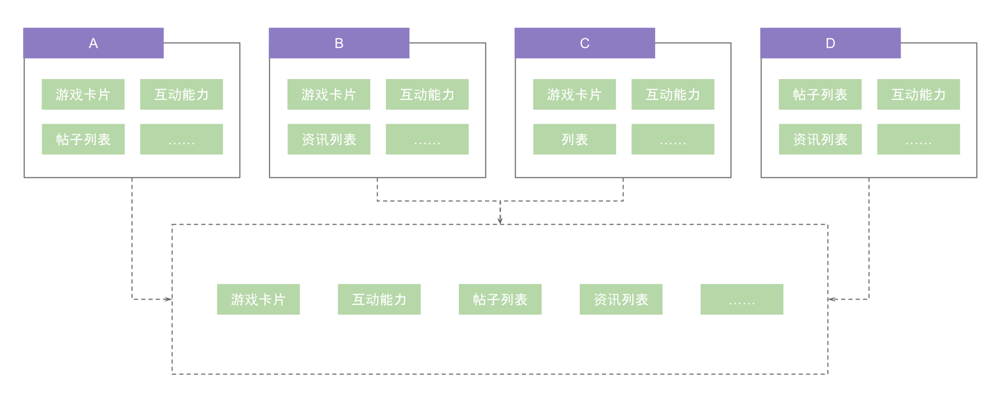
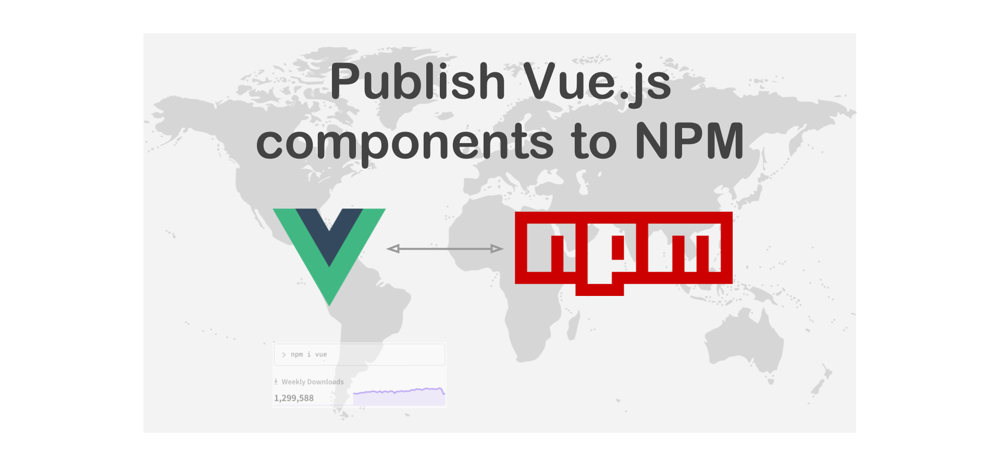
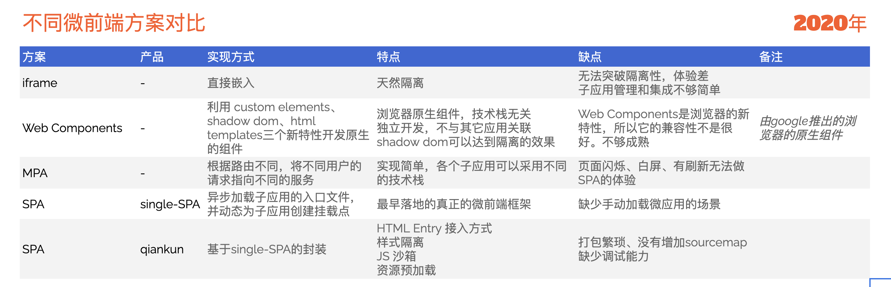

# 微前端解决方案在游戏业务的落地与实践

2020 年 8 月份，游戏线业务经过调整后，开始接触游戏论坛项目，该项目是 2017 年创建，经过三年的迭代以及不同开发人员的维护。与游戏宝、游戏资讯等共同为游戏中心、商店、联运等平台提供内容服务。接触几个月，在开发维护的过程中碰到诸多挑战。

## 游戏业务目前面临的挑战

由于经过长时间的迭代和更新，加上开发同学换了一波又一波，导致代码风格、架构设计不统一，维护成本逐步上升。除此之外，论坛项目与其它很多项目，譬如游戏资讯、游戏宝等存在公共业务逻辑，像游戏卡片、评论互动能力等等。

基础能力和中间层的长期缺乏，导致项目间以及项目内存在大量冗余，无形中为后续需求迭代和开发增加了大量的负担，同一个功能要在不同项目中开发很多遍。


就拿上面游戏卡片来说，在**游戏论坛**、**游戏资讯**、**游戏专区**、**游戏宝**等等项目中均有实现。当我们需要增加预约卡片时，我们需要修改**游戏论坛**项目增加预约卡片、需要修改**游戏资讯**项目增加预约卡片、需要修改**游戏专区**项目增加预约卡片、需要修改**游戏宝**项目增加预约卡片等等，这还不包括后续可能还有项目中会有游戏卡片需求，可见维护成本成倍增加。



如上图所示，其实不同项目中公用的能力应该只有一处实现，同时，前端技术日新月异，技术栈的更新也非常的快，如何解决新技术与旧项目之间的矛盾也日益加剧……

## 关于微前端解决方案的思考

经过游戏卡片业务需求的沉痛教训，解决当前面临的问题就成了摆在我们眼前的重要任务。首先可以确定的是一些公共的前端能力一定要抽离出来独立提供，这样才能解决项目间冗余的问题，同时还需要提供基础组件库和公共函数库来解决项目内的复用问题。在构建基础能力的同时，如何平稳过渡，如何在老项目中使用新的技术栈也是值得我们思考的问题。

对于基础能力的抽离，我们也考虑过使用 `npm` 组件的方式，使用 `npm` 组件虽然能解决项目间代码复用的问题，但集成以及更新不够便利、同时很多业务比较复杂甚至包括接口以及服务，使用组件在业务形态上不够合适。



最重要的一点是，这种方案局限了技术栈，如果要使用这个组件就必须是在同样技术栈的项目里。而我们的基础能力恰恰可能会提供给外部团队使用，我们不能要求外部团队使用相同的技术栈。为了隔离技术栈带来的影响，我们很自然想到可以把基础能力抽离成 web 服务，然后使用 iframe 嵌入到业务项目中使用，这看上去是能够解决我们面临的问题。但考虑如下图所示的情况：抽出来的游戏卡片中需要弹出一个 `dialog` 框，试想一下用 iframe 能实现吗？

::: center

:::

iframe 最大问题也在于他的隔离性无法被突破，导致应用间上下文无法被共享，随之带来的开发体验、产品体验等等问题。

**最近几年微前端解决方案在前端领域大红大紫，是否可以使用微前端解决方案来正面狙击当下的问题呢？**

回答这个问题之前，我们需要了解一下什么是微前端。

### 什么是微前端

微前端是一种多个团队通过独立发布功能的方式来共同构建现代化 web 应用的技术手段及方法策略。

> Techniques, strategies and recipes for building a **modern web app** with **multiple teams** that can **ship features independently**. -- [micro-frontends](https://micro-frontends.org/)

微前端的概念最早出现于 2016 年，是微服务概念向前端领域延伸，出处于[thoughtworks](https://www.thoughtworks.com/radar/techniques/micro-frontends)


微前端架构旨在解决单体应用在一个相对长的时间跨度下，由于参与的人员、团队的增多、变迁，从一个普通应用演变成一个巨石应用([Frontend Monolith](https://www.youtube.com/watch?v=pU1gXA0rfwc))后，随之而来的应用不可维护的问题，这类问题在企业级 web 应用中尤其常见。

所以微前端的核心思想就是**将一个 web 应用拆分成不同功能模块的组合，不同功能模块由不同的团队维护，独立开发独立部署，还能获得产品完整的一致性体验。**

### 我们为什么需要微前端

看完微前端的核心思想后，是不是发现这不就是我们想要的吗？

1. 业务模块复用度高，出现在很多项目当中，由于包括业务逻辑和接口服务，通过组件复用不合适。
2. 项目过于庞大，代码编译慢，任意改动需要全项目发布，开发体差，需要一种更高维度的解耦方案。
3. 单一技术栈无法满足你的业务需求。
4. 项目技术栈过于老旧，相关技能的开发人员少，功能扩展吃力，重构成本、维护成本高。
   > 随着时间的推移，团队人员的流动，会慢慢发现一些事情：比如原维护团队以 vue3 的视角看 vue2 的世界，就像在看原始人用原始的姿势拉着原始的屎，又或者新人进来以 react 看 vue，鸡同鸭讲理念不同。 微前端的理想状态也许就是用最爽的姿势写最新的业务模块吧。

使用微服务架构后具备如下优势：

- **复杂度可控**: 每一个 UI 业务模块由独立的前端团队开发，避免代码巨无霸，保持开发时的高速编译，保持较低的复杂度，便于维护与提高开发效率。
- **独立部署**: 每一个模块可单独部署，颗粒度可小到单个组件的 UI 独立部署，不对其他模块有任何影响。
- **技术选型灵活**: 也是最具吸引力的，在同一项目下可以使用如今市面上所有前端技术栈，也包括未来的前端技术栈。
- **容错**: 单个模块发生错误，不影响全局。
- **扩展**: 每一个服务可以独立横向扩展以满足业务伸缩性，与资源的不必要消耗。

### 我们面临哪些问题和挑战

1. Single SPA、Piral、Qiankun、Icestark，如何选择？
2. 我们的业务会走向哪里？
3. 现有微前端解决方案无法满足业务需求，该怎么解决？
4. 前端微服务化后我们该如何编写我们的代码?
5. 不同项目开发团队之间该如何协作?

## 微前端解决方案如何在游戏业务中落地

在资料站项目中，有需求要穿插游戏卡片，按照以往的做法，把游戏卡片的逻辑拷贝到新项目中就好了，开发一时爽，维护累够呛！再不对游戏卡片动手，就又给自己掘一个坟墓。

游戏卡片承担着流量变现的作用，对于引导用户预约、下载游戏发挥着举足轻重的作用，所以游戏卡片会在很多项目中使用，不同的项目中呈现的形式也有所不同，有的是在内容底部，有的是悬浮在视窗底部，有的是穿插在内容中（并且不止一个），同时不同的游戏状态不同，卡片还分为预约卡片、下载卡片、预下载卡片等，如下图所示：


整个游戏卡片业务足够复杂，需要请求接口，下载时还要实时更新状态，还要与客户端宿主应用交互，从业务上考虑，拆成独立的微前端服务是合适的。

### 开发 vivo 自己的微前端解决方案

在明确了业务需求后，我们调研了目前市面上常用的微前端解决方案，并整理分析如下：



结合过往的工作经验，iframe 势必不满足现有业务需求，首先排除了。Web Components 考虑到还有很长的路要走，一时半会儿兼容性不满足要求。MPA 的方案会有页面刷新导致的闪烁，对于习惯了 SPA 体验的项目来说也不适用。最后决定使用最接近业务需求基于 single-SPA 封装的 qiankun 来实现我们微前端的业务场景。

但在实践的过程中，我们发现一个很严重的问题：就是我们业务存在大量与原生客户端应用交互的场景，譬如游戏卡片需要接收客户端应用通知游戏下载进度的消息。如下图所示：


而现有通信方案就是通过在 JavaScript Runtime 上挂载回调函数，供客户端应用调用来实现数据的传递。现有的微前端方案为了隔离子应用间的运行时，并且避免污染全局运行时，使用了沙箱机制，如下图所示：


所以子应用的 js 文件是运行在一个独立的沙箱里，沙箱代理了全局的运行时，可以获取全局上的变量，但是**子应用中往全局运行时上新添加的变量只是添加在了子应用对应的沙箱里**，也就是说主应用的运行时上并没有子应用添加的变量。如果关闭沙箱机制，在多实例时又会造成互相影响的情况，而我们子应用是可能存在多实例的。

所以针对游戏业务独有的业务场景，现有的微前端方案无一能满足我们的需求！再结合使用开源方案的管理规范以及第三方依赖可能带来的风险，我们决定在 qiankun 的基础上，开发属于 vivo 自己微前端解决方案。由于 qiankun 使用的是 `MIT` 的开源协议，可以使用其源码并作适当的修改后，选择闭源使用。

1. 私有化

首先，我们去掉了部分第三方的依赖，譬如 `father-build`、`tslib`、`import-html-entry`等，打包改成基础的 `babel` 提供的编译能力，避免过多的外部不必要的依赖。

```json
{
  "scripts": {
    "build:esm": "rm -rf es && cross-env NODE_ENV=esm babel src --out-dir es --extensions .ts,.js && tsc",
    "build:esm:dev": "cross-env NODE_ENV=esm babel src --out-dir es --extensions .ts,.js --source-maps",
    "build:cjs": "cross-env NODE_ENV=cjs babel src --out-dir lib --extensions .ts,.js"
  }
}
```

与此同时，针对 demo 作了定制化调整， 整个构建、发布流程以及调试能力也作了更改来满足业务上的需要和便利性。

增加团队统一使用的规范脚手架 `specification`，它集成了统一的**代码规范**、**代码检查**、**自动修复**、**提交规范**、**版本管理规范**等等能力。


2. 增加在沙箱模式下，往全局 window 上添加函数的能力

insight 在 `mount` 生命周期中，注入了 `setGlobalFunction` 方法。当多个子应用挂载相同的 `funcName` 时，insight 负责管理所有子应用并逐一调用。如果子应用挂载的 `funcName` 已经存在，insight 会负责调用它，并在子应用 `unmount` 时恢复它。设计如下图所示：


- 参数

  - funcName - `string` - 必选 要挂载的函数名
  - handler - `function` - 必选 对应的处理函数

> funcName 支持用.分隔的字符串，如'system.onmessage'，此时，handler 会挂载到 `window.system.onmessage` 上。**注意，此种用法你需要保证 system 等中间层级是存在的，否则会报错，insight 不会默认添加中间层级的内容，因为不好回收**

- 用法

  设置挂载到全局 `window` 上的回调函数

- 示例

  ```js
  /**
   * 应用每次进入都会调用 mount 方法，通常我们在这里触发应用的渲染方法
   */
  export async function mount(props) {
    const { container, setGlobalState, onGlobalStateChange, setGlobalFunction } = props // 请参考 api 章节中的介绍

    setGlobalFunction('abc', (...args) => {
      console.log(`abc:${props.name}`, ...args)
    })

    setGlobalFunction('system.onmessage', (...args) => {
      console.log(`system.onmessage:${props.name}`, ...args)
    })

    ReactDOM.render(<App />, props.container ? props.container.querySelector('#root') : document.getElementById('root'))
  }
  ```

### 游戏卡片业务拆分重构

我们选取了游戏论坛中的游戏卡片，抽离出来单独部署成微前端服务，将之前的卡片逻辑按照**横向分类、纵向分层**的思想，全新重构了。之前将下载卡片、预约卡片、预下载卡片视图层耦合在一起，导致不同种类的卡片业务逻辑也耦合在一起，维护困难。除此之外，也没有数据层和适配层。重构之后的示意图如下：


### 游戏卡片使用微前端解决方案接入

#### 主应用

安装 `@game/insight`，使用 `loadMicroApp` 加载子应用即可。

```
npm i @game/insight -S
```

```js
// game-card/index.vue

import { loadMicroApp } from '@game/insight'

const MICRO_APP_URL =
  process.env.NODE_ENV === 'dev'
    ? '//game-card.vivo.com.cn:7104/game-card/'
    : process.env.NODE_ENV === 'test'
    ? 'https://gamebbsh5-test.vivo.com.cn/game-card/'
    : process.env.NODE_ENV === 'pre'
    ? 'https://gamebbsh5-pre.vivo.com.cn/game-card/'
    : 'https://gamebbsh5.vivo.com.cn/game-card/'

// 加载子应用
loadMicroApp({
  name: 'game-card-app',
  entry: MICRO_APP_URL,
  container: '#gamecard-container',
  props: {
    // 卡片埋点上报参数
    reportData: {
      package_name: this.$props.packageName,
      dl_page: 'datastation', // 表示接入卡片的项目-资料站
      f_page: (query && query.f_Page) || '' // 资料站特有-上级来源页面
    }
  }
})
```

#### 子应用

参考 `@game/insight` 的接入文档，子应用无须安装任何依赖，只需要在子应用入口导出相应的生命周期钩子，然后配置导出接口即可。

```js
// main.js

if (!window.__POWERED_BY_INSIGHT__) {
  // 非使用 insight 加载时，参数由查询参数提供
  const queryObject = url.getQueryObjectByUrl()
  store.commit(MUT_SET_PACKAGE_NAME, queryObject.package_name)
  render()
}

export async function bootstrap() {
  console.log('%c ', 'color: green;', '游戏卡片微服务启动...')
}

export async function mount(props) {
  console.log('[game-card] props from origin', props)
  // 微服务模式下，参数由宿主提供
  store.commit(MUT_SET_PACKAGE_NAME, props.reportData.package_name)
  render(props.container)

  // 请求接口返回的数据中有包名存在即有卡片显示，向接入方回传该状态，以方便做UI处理
  store.subscribe((mutation, payload) => {
    if (mutation.type === MUT_SET_GAME_INFO) {
      props.setGlobalState({
        showCard: !!store.getters.gameInfo.packageName // 卡片信息中包名存在，则展示卡片，返回true
      })
    }
  })
}

export async function unmount() {
  console.log('%c ', 'color: green;', '游戏卡片微服务卸载...')
}

/**
 * 如果宿主应用有更新参数的需求，可以通过调用此生命周期钩子
 * @param {*} props 与 mount 里的参数相同
 */
export async function update(props) {
  // 微服务模式下，参数由宿主提供
  store.commit(MUT_SET_PACKAGE_NAME, props.reportData.package_name)
  getGameInfo()
}
```

#### 需要注意的问题

在整个实践过程中，也碰到一些问题，这里简单介绍一下。

1. 子应用所有资源需要允许跨域

生产环境下，需要使用运维手段，配置 Nginx

开发环境下，可以通过 devServer 配置请求头，如下所示：

```js
  devServer: {
    headers: {
      'Access-Control-Allow-Origin': '*'
    }
  }
```

2. 子应用资源路径要设置成绝对路径

由于子应用的静态资源是通过 window.fetch 获取的，所以如果使用相对路径，接入到主应用中时会相对于主应用的域名发出请求。所以推荐将静态资源以及接口的路径都在打包时处理成为绝对路径。

如下所示，静态资源设置 publicPath 配置，值为不同环境下的地址，譬如 开发环境就为 `http://localhost:7104/game-card/`，测试环境可能就是 `https://gamebbsh5-test.vivo.com.cn/game-card/`，依次类推设置

```js
const assetsPublicPath = `${process.env.VUE_APP_WEBSITE_URL}/game-card/`

module.exports = {
  publicPath: assetsPublicPath,
  // 自定义webpack配置
  chainWebpack: config => {
    config.module
      .rule('images')
      .use('url-loader')
      .loader('url-loader')
      .tap(options => {
        // 修改它的选项...
        return {
          limit: 4096, // 小于4kb将会被打包成 base64
          fallback: {
            loader: 'file-loader',
            options: {
              name: 'img/[name].[hash:8].[ext]',
              publicPath: assetsPublicPath
            }
          }
        }
      })

    config.module
      .rule('fonts')
      .use('url-loader')
      .loader('url-loader')
      .tap(options => {
        // 修改它的选项...
        return {
          limit: 4096, // 小于4kb将会被打包成 base64
          fallback: {
            loader: 'file-loader',
            options: {
              name: 'fonts/[name].[hash:8].[ext]',
              publicPath: assetsPublicPath
            }
          }
        }
      })
  }
}
```

另外，对于 css 中使用的图片还有字体文件，也需要作相应的处理。推荐使用 `url-loader` 把小于 4k 的直接打包 base64 格式的，对于大于 4k 的图片和字体，借助 `file-loader` 在打包时注入绝对路径。如上面配置所示。

最后，api 接口也需要设置为绝对路径，如下示例所示：

```js
import fetch from './base'

const SERVER_URL = process.env.VUE_APP_SERVER_URL
/**
 * 请求游戏卡片信息
 * @param {*} params
 */
export const getGameInfo = async params => {
  try {
    const res = await fetch({
      url: `${SERVER_URL}/xxx/xxxx/getRelGameInfo`,
      params
    })
    return res.data
  } catch (e) {
    console.error('请求卡片信息失败')
  }
}
```

3.  避免通过 document 操作 DOM

由于子应用是通过 window.fetch 获取到以 DOM 元素形式插入到主应用中，所以在子应用中如果直接使用 document 操作 DOM，实际上是修改主应用的 DOM。举一个比较实际的例子，对于移动端适配，目前常用的方案是 rem + flexible 的方案，此方案的原理就是根据屏幕宽度和设备像素比设置根元素的 `font-size`，然后再利用构建工具把源码中的 `px` 转化 `rem` 达到在不同设备上显示一致目的。

如果在子应用中运用这个方案，那么子应用会把 `font-size` 设置到主应用的根节点，不光会影响到全局，还让主应用和子应用产生了耦合。所以子应用接入时，避免使用此方案，可以替换成 [`viewport` 方案](https://github.com/evrone/postcss-px-to-viewport/blob/master/README_CN.md)，直接根据设备宽度计算，不需要设置 `font-size` 值。

## 未来的规划

微前端解决方案已经在游戏卡片的拆分重构中发挥重要的作用，目前来看效果符合预期的。再回过头来看之前的问题，我们发现：


在游戏卡片的实践过程中，我们评估之前的实现，假设维护的成本是 n 人\*日，那么实际工作投入是 28+4n。而接入微服务后，工作量预估为 14+n，详见上图。可以看到，在游戏卡片这单一项能力节省的工作量成本为 14+3n。如果考虑除了游戏卡片，还会有其它能力抽离和使用微服务接入，对于工作效率提升的比率将会在 50% ~ 75%之间。

但因为目前只在资料站中实践，接下来会完成以下事情：

1. 整理目前不同项目中的游戏卡片，统一替换为微前端服务提供的卡片
2. 进一步完善 insight 框架，实现更多符合业务要求的功能，譬如 数据统计、增强数据通信等等
3. 整理业务，抽取更多的能力，使用微服务提供，包括但不限于互动能力、编辑能力等等
4. 微前端解决方案推广覆盖更多的项目
