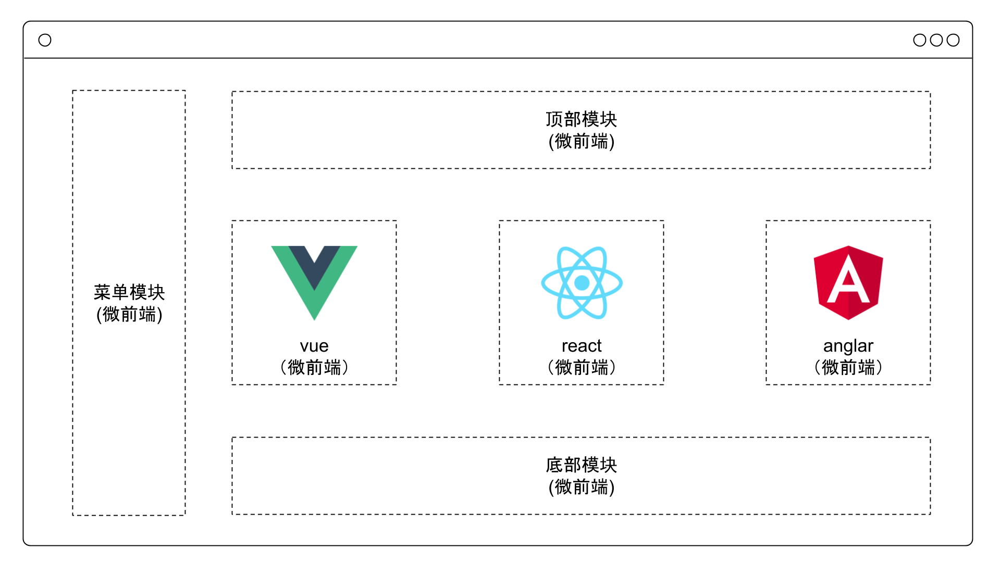

# 快速上手

在上手前，我们需要先了解一下 insight。 insight 在保证一个系统的操作体验基础上，实现了各个子应用的独立开发和部署。主应用只要安装 insight，便能通过 insight 来管理子应用的注册和渲染，并统计子应用信息，将各个子应用与主应用彻底解耦。

它具备如下特性：

- 子应用独立开发并部署为 web 服务，可以是任意技术栈
- 主应用只需要安装 @game/insight 来管理子应用，不与子应用产生任何耦合
- 现有的 web 服务很容易改造成子应用，接入成本极低
- 主应用和子应用同属于一个系统环境，用户体验好



**由于子应用的资源(包括 `index.html` 文件)是通过 `window.fetch` 来获取，然后插入到当前主应用的文档中的，所以对于子应用中的接口、资源请求不能使用相对路径（除非子应用和主应用域名一致）。因为如果使用相对路径在独立访问时是使用子应用的域名，而集成到主应用后是使用主应用的域名。**

**也就是说当子应用集成到主应用后，是没有子应用域名的概念的，这一点在接入或者开发子应用时尤其注意。**

## 主应用

### 安装 insight

```bash
npm i @game/insight -S
```

### 在主应用中注册子应用

```js
import { registerMicroApps, start } from '@game/insight'

registerMicroApps(
  [
    {
      name: 'vue',
      entry: '//localhost:7101',
      container: '#subapp-viewport',
      activeRule: '/vue'
    },
    {
      name: 'purehtml',
      entry: '//localhost:7102',
      container: '#subapp-viewport',
      activeRule: '/purehtml'
    },
    {
      name: 'vue3',
      entry: '//localhost:7103',
      container: '#subapp-viewport',
      activeRule: '/vue3'
    }
  ],
  {
    beforeLoad: [
      app => {
        // 获取当前应用的状态
        const status = getAppStatus(app.name)
        console.log('[LifeCycle] before load %c%s status:%s', 'color: green;', app.name, status)
      }
    ],
    beforeMount: [
      app => {
        console.log('[LifeCycle] before mount %c%s', 'color: green;', app.name)
      }
    ],
    afterMount: [
      app => {
        // 获取当前应用的状态
        const status = getAppStatus(app.name)
        console.log('[LifeCycle] after mount %c%s status:%s', 'color: green;', app.name, status)
      }
    ],
    beforeUnmount: [
      app => {
        console.log('[LifeCycle] before unmount %c%s', 'color: green;', app.name)
      }
    ],
    afterUnmount: [
      app => {
        console.log('[LifeCycle] after unmount %c%s', 'color: green;', app.name)
      }
    ]
  }
)

start()
```

当子应用信息注册完之后，insight 内部维护了所有子应用的配置信息，包括路由规则、web 服务地址等，同时劫持了 window.history 相关的几个跳转事件，一旦浏览器的 url 发生变化，便会自动触发 insight 的匹配逻辑，所有 activeRule 规则匹配上的子应用就会被插入到指定的 container 中，同时依次调用子应用暴露出的生命周期钩子。

如果子应用不是直接跟路由关联的时候，也可以选择手动加载子应用的方式：

```js
import { loadMicroApp } from '@game/insight'

// 加载子应用
loadMicroApp({
  name: 'gamecard',
  entry: '//game-card.vivo.com.cn:7104/game-card/', // 请去游戏卡片工程启动服务 https://gitlab.vmic.xyz/gamehelper/game-card
  container: '#gamecard-container',
  props: {
    reportData: {
      package_name: 'com.tencent.tmgp.sgame',
      dl_page: 'default'
    }
  }
})
```

## 子应用

子应用不需要额外安装任何其他依赖即可接入 insight 主应用，对于使用 webpack 等打包工具的情况只需要在子应用入口导出相应的生命周期钩子即可。

### 导出相应的生命周期钩子

子应用需要在自己的入口 js (通常就是你配置的 webpack 的 entry js) 导出 `bootstrap`、`mount`、`unmount` 三个生命周期钩子，以供主应用在适当的时机调用。

```jsx
/**
 * bootstrap 只会在子应用初始化的时候调用一次，下次子应用重新进入时会直接调用 mount 钩子，不会再重复触发 bootstrap。
 * 通常我们可以在这里做一些全局变量的初始化，比如不会在 unmount 阶段被销毁的应用级别的缓存等。
 */
export async function bootstrap(props) {
  const {
    name, // The name of the application
    singleSpa, // The singleSpa instance
    mountParcel, // Function for manually mounting
    customProps // Additional custom information
  } = props // Props are given to every lifecycle  请参考 https://single-spa.js.org/docs/building-applications#lifecyle-props
  console.log('micro app bootstraped')
}

/**
 * 应用每次进入都会调用 mount 方法，通常我们在这里触发应用的渲染方法
 */
export async function mount(props) {
  const { container, setGlobalState, onGlobalStateChange, setGlobalFunction } = props // 请参考 api 章节中的介绍
  ReactDOM.render(<App />, props.container ? props.container.querySelector('#root') : document.getElementById('root'))
}

/**
 * 应用每次 切出/卸载 会调用的方法，通常在这里我们会卸载子应用的应用实例
 */
export async function unmount(props) {
  const { container } = props

  ReactDOM.unmountComponentAtNode(container ? container.querySelector('#root') : document.getElementById('root'))
}

/**
 * 可选生命周期钩子，仅使用 loadMicroApp 方式加载子应用时生效
 */
export async function update(props) {
  console.log('update props', props)
}
```

insight 基于 single-spa，所以你可以在[这里](https://single-spa.js.org/docs/building-applications.html#registered-application-lifecycle)找到更多关于子应用生命周期相关的文档说明。

### 配置子应用的打包工具

在子应用中导出相应的生命周期钩子还不够，为了让主应用能正确识别子应用导出的生命周期钩子，子应用的打包工具需要增加如下配置：

```js
const packageName = require('./package.json').name

module.exports = {
  output: {
    library: `${packageName}-[name]`,
    libraryTarget: 'umd',
    jsonpFunction: `webpackJsonp_${packageName}`
  }
}
```

> jsonpFunction 用于异步加载(async load) chunk，webpack5 去掉了此配置，所以 webpack5 时可以不设置此选项

相关配置介绍可以查看 [webpack 相关文档](https://webpack.js.org/configuration/output/#outputlibrary)。

**insight 默认是取最后一个 js 文件中导出的生命周期钩子**，类似如下子应用，导出的生命周期钩子应该在 app.13657992.js 中，如果 webpack 配置中配置了多个入口，请保证导出生命周期钩子的入口在最后一个。

```html
<body>
  <div id="app"></div>
  <script src="/game-card/js/chunk-vendors.6577f8f7.js"></script>
  <script src="/game-card/js/app.13657992.js"></script>
</body>
```

**否则，你需要增加 entry 字段来手动指定哪一个 js 文件，导出了生命周期钩子**，如下所示：

```html
<body>
  <div id="app"></div>
  <script src="/game-card/js/app.13657992.js" entry></script>
  <script src="/game-card/js/chunk-vendors.6577f8f7.js"></script>
</body>
```

### 非 webpack 构建的子应用接入

对于非 webpack 构建的子应用，需要额外声明一个 script，用于导出相对应的生命周期钩子。
例如:

#### 1. 声明 entry 入口

```html
<!DOCTYPE html>
<html lang="en">
  <head>
    <meta charset="UTF-8" />
    <meta name="viewport" content="width=device-width, initial-scale=1.0" />
    <title>Purehtml Example</title>
    <script src="//cdn.bootcss.com/jquery/3.4.1/jquery.min.js"></script>
  </head>
  <body>
    <div style="display: flex; justify-content: center; align-items: center; height: 200px;">Purehtml Example</div>
    <div id="purehtml-container" style="text-align:center"></div>
    <script src="//localhost:7102/entry.js" entry></script>
  </body>
</html>
```

#### 2. 在 entry js 里导出生命周期钩子到 window 上

```javascript
const render = $ => {
  $('#purehtml-container').html('Hello, render with jQuery')
  return Promise.resolve()
}

;(global => {
  global['purehtml'] = {
    bootstrap: () => {
      console.log('purehtml bootstrap')
      return Promise.resolve()
    },
    mount: () => {
      console.log('purehtml mount')
      return render($)
    },
    unmount: () => {
      console.log('purehtml unmount')
      return Promise.resolve()
    }
  }
})(window)
```

你可以直接参照 examples 中 purehtml 部分的代码。

### 子应用挂载全局函数

为了隔离子应用和主应用，以及子应用之间互相产生的影响，微前端框架提供了沙箱的支持(请参考 api 章节中，对沙箱的介绍)。这导致了在子应用中往 `window` 添加的函数，实际上只添加到了子应用沙箱上，主应用中并不能调用。而互联网游戏业务中，存在大量与游戏中心等原生应用交互的实现，目前的技术方案就是 js 层向 全局 `window` 上挂载函数，然后客户端应用通过调用全局 `window` 上挂载的函数来实现客户端应用与 js 的通信。

所以如果子应用中存在与客户端通信的需求，就要考虑如何添加函数到全局 `window`上的问题。

insight 在 `mount` 生命周期中，注入了 `setGlobalFunction` 方法。当多个子应用挂载相同的 `funcName` 时，insight 负责遍历所有子应用并逐一调用。如果子应用挂载的 `funcName` 已经存在，insight 会负责调用它，并在子应用 `unmount` 恢复它。

- 参数

  - funcName - `string` - 必选 要挂载的函数名
  - handler - `function` - 必选 对应的处理函数

::: warning 警告
funcName 支持用.分隔的字符串，如'system.onmessage'，此时，handler 会挂载到 `window.system.onmessage` 上。**注意，此种用法你需要保证 system 等中间层级是存在的，否则会报错，insight 不会默认添加中间层级的内容，因为不好回收**
:::

- 用法

  设置挂载到全局 `window` 上的回调函数

- 示例

  ```js{7-9,11-13}
  /**
   * 应用每次进入都会调用 mount 方法，通常我们在这里触发应用的渲染方法
   */
  export async function mount(props) {
    const { container, setGlobalState, onGlobalStateChange, setGlobalFunction } = props // 请参考 api 章节中的介绍

    setGlobalFunction('abc', (...args) => {
      console.log(`abc:${props.name}`, ...args)
    })

    setGlobalFunction('system.onmessage', (...args) => {
      console.log(`system.onmessage:${props.name}`, ...args)
    })

    ReactDOM.render(<App />, props.container ? props.container.querySelector('#root') : document.getElementById('root'))
  }
  ```

### 子应用接入注意事项

#### 1. 子应用所有资源需要允许跨域

生产环境下，需要使用运维手段，配置 Nginx

开发环境下，可以通过 devServer 配置请求头，如下所示：

```js
  devServer: {
    headers: {
      'Access-Control-Allow-Origin': '*'
    }
  }
```

#### 2. 子应用资源路径要设置成绝对路径

由于子应用的静态资源是通过 window.fetch 获取的，所以如果使用相对路径，接入到主应用中时会相对于主应用的域名发出请求。所以推荐将静态资源以及接口的路径都在打包时处理成为绝对路径。

如下所示，静态资源设置 publicPath 配置，值为不同环境下的地址，譬如 开发环境就为 'http://localhost:7104/game-card/'，测试环境可能就是 'https://gamebbsh5-test.vivo.com.cn/game-card/'，依次类推设置

```js
const assetsPublicPath = `${process.env.VUE_APP_WEBSITE_URL}/game-card/`

module.exports = {
  publicPath: assetsPublicPath,
  // 自定义webpack配置
  chainWebpack: config => {
    config.module
      .rule('images')
      .use('url-loader')
      .loader('url-loader')
      .tap(options => {
        // 修改它的选项...
        return {
          limit: 4096, // 小于4kb将会被打包成 base64
          fallback: {
            loader: 'file-loader',
            options: {
              name: 'img/[name].[hash:8].[ext]',
              publicPath: assetsPublicPath
            }
          }
        }
      })

    config.module
      .rule('fonts')
      .use('url-loader')
      .loader('url-loader')
      .tap(options => {
        // 修改它的选项...
        return {
          limit: 4096, // 小于4kb将会被打包成 base64
          fallback: {
            loader: 'file-loader',
            options: {
              name: 'fonts/[name].[hash:8].[ext]',
              publicPath: assetsPublicPath
            }
          }
        }
      })
  }
}
```

另外，对于 css 中使用的图片还有字体文件，也需要作相应的处理。推荐使用 `url-loader` 把小于 4k 的直接打包 base64 格式的，对于大于 4k 的图片和字体，借助 `file-loader` 在打包时注入绝对路径。如上面配置所示。

最后，api 接口也需要设置为绝对路径，如下示例所示：

```js
import fetch from './base'

const SERVER_URL = process.env.VUE_APP_SERVER_URL
/**
 * 请求游戏卡片信息
 * @param {*} params
 */
export const getGameInfo = async params => {
  try {
    const res = await fetch({
      url: `${SERVER_URL}/mvc/v3/module/getRelGameInfo`,
      params
    })
    return res.data
  } catch (e) {
    console.error('请求卡片信息失败')
  }
}
```

#### 3. 避免通过 document 操作 DOM

由于子应用是通过 window.fetch 获取到以 DOM 元素形式插入到主应用中，所以在子应用中如果直接使用 document 操作 DOM，实际上是更新主应用的 DOM。举一个比较实际的例子，对于移动端适配，目前常用的方案是 rem + flexible 的方案，此方案的原理就是根据屏幕宽度和设备像素比设置根元素的 `font-size`，然后再利用构建工具把源码中的 `px` 转化 `rem` 达到在不同设备上显示一致目的。

如果在子应用中运用这个方案，那么子应用会把 `font-size` 设置到主应用的根节点，不光会影响到全局，还让主应用和子应用产生了耦合。所以子应用接入时，避免使用此方案，可以替换成 [`viewport` 方案](https://github.com/evrone/postcss-px-to-viewport/blob/master/README_CN.md)，直接根据设备宽度计算，不需要设置 `font-size` 值。

#### 4. 子应用独立运行

微前端的框架就是为了主应用和子应用不耦合，能够独立运行和部署，所以子应用也应该是能够独立运行的完整的 web 服务。从上面我们知道，我们在子应用中导出了生命周期钩子给主应用使用，所以在主应用内加载的子应用，它的渲染是由主应用触发并管理的，那如果独立运行子应用呢？

`@game/insight` 中会在加载子应用之前，往 `window` 上注入 `__POWERED_BY_INSIGHT__` 全局变量，所以可以在子应用中通过该全局变量来启动并渲染子应用，从而实现子应用单独运行的目的。

如下面实例所述：

```js
if (!window.__POWERED_BY_INSIGHT__) {
  // 非使用 insight 加载时，参数由查询参数提供
  const queryObject = url.getQueryObjectByUrl()
  store.commit(MUT_SET_PACKAGE_NAME, queryObject.package_name)
  store.commit(MUT_SET_REPORT_DATA, queryObject)
  render()
}

export async function bootstrap() {
  console.log('%c ', 'color: green;', '游戏卡片微服务启动...')
}

export async function mount(props) {
  console.log('[game-card] props from origin', props)
  // 微服务模式下，参数由宿主提供
  store.commit(MUT_SET_PACKAGE_NAME, props.reportData.package_name)
  store.commit(MUT_SET_REPORT_DATA, props.reportData)
  render(props.container)
}
```
